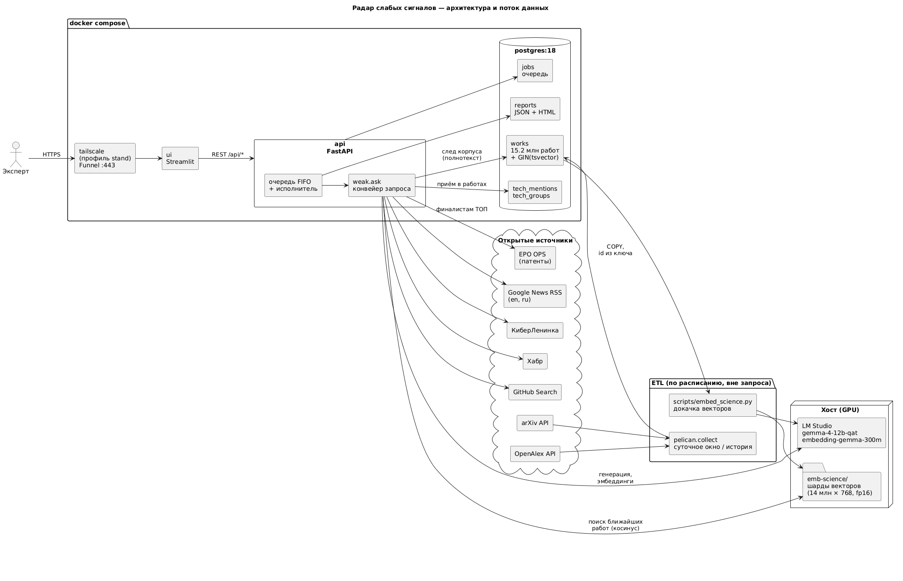

# Техническая документация

Радар слабых сигналов: открытый запрос по технологическому направлению → ТОП-15
зарождающихся технологий с описанием, преимуществом, кейсом, источниками, уверенностью и
объяснением; зрелые технологии, стандарты, общие категории, хайп и шум исключаются с
указанием причины. Задача ЛЦТ-2026, кейс Газпромбанк.Тех.

Схема архитектуры — [architecture.puml](architecture.puml) (PlantUML), отчёт об оценке —
[../reports/weak-eval.md](../reports/weak-eval.md).

## 1. Что считается слабым сигналом

Опора — названные приёмы литературы, а не собственное определение:

- **Зарождающаяся технология** — Rotolo, Hicks & Martin, *Research Policy* 2015: радикальная
  новизна, быстрый рост, связность (coherence), заметное влияние, неопределённость.
- **Слабый сигнал** — Yoon, *Expert Systems with Applications* 2012: низкая видимость
  (degree of visibility) при росте (degree of diffusion).
- **Где резать зрелое** — BERTrend (arXiv:2411.05930): перцентиль популярности в окне.

Датасет заказчика (100 строк, все положительные) показывает, что методолог определяет
сигнал в первую очередь **деньгами и игроками**: в обоснованиях 105 упоминаний раундов и
сумм против 23 «мало публикаций», у строки в среднем 4 компании. Поэтому система ищет по двум
потокам — научному (публикации) и денежному (новости о раундах, пилотах, сделках) — и
единица выдачи у неё **направление плюс названные игроки**, а не отдельная статья.

## 2. Архитектура

Три слоя, как требует ТЗ: интерфейс, инференс, хранение и сбор данных.

| Слой | Компонент | Роль |
|---|---|---|
| Интерфейс | `ui` — Streamlit (`ui/app.py`) | форма запроса, очередь с прогресс-баром, отчёт-документ (ТОП строками, каждая раскрывается в инсайт; исключённое), история |
| API и инференс | `api` — FastAPI (`pelican.api`) | очередь запросов, единственный исполнитель, конвейер `pelican.weak.ask` |
| Модели | LM Studio на хосте | `google/gemma-4-12b-qat` — генерация, `google/embedding-gemma-300m` — эмбеддинги; OpenAI-совместимый `/v1` |
| Хранение | Postgres 18 | корпус `works`, разметка `tech_mentions`, очередь `jobs`, отчёты `reports` |
| Векторы | файлы-шарды `emb-science/` | 14 млн векторов × 768 (float16), только чтение |
| Сбор | `pelican.collect`, `scripts/embed_science.py` | суточное окно и история arXiv/OpenAlex; докачка векторов |

**Очередь.** Локальная `gemma-4-12b-qat` выполняет вызовы по одному, поэтому запросы идут строго по
одному: новый встаёт в очередь (FIFO в таблице `jobs`, выдача под `FOR UPDATE SKIP
LOCKED`), видит своё место и ожидаемое время начала и стартует сам, когда закончится
предыдущий. Параллельный запуск растянул бы оба вдвое и пробил потолок заказчика в 20
минут. Очередь в базе переживает перезапуск контейнера; брошенное задание возвращается в
голову очереди.

## 3. Данные и хранилище

**Корпус** — научные работы arXiv (1.15 млн) и OpenAlex (13.8 млн): заголовок, аннотация,
дата, ссылка, срез OpenAlex. Всего 15.2 млн работ, 14 ГБ в Postgres с индексами.

- **Полнотекстовый индекс вместо подстроки.** След технологии в корпусе (сколько работ и с
  какого года) считается запросом `tsvector @@ tsquery` по GIN-индексу (конфигурация
  `simple`: без стемминга, короткие токены вроде «ai» в индексе остаются). Сверка с
  подстрочным поиском на 160 именах и полном корпусе: ранговая корреляция числа работ 0.999
  у ядер технологий и 0.96 у названий направлений, медиана отношения 1.00; время — 42 с
  против 1249 с полного прохода (`scripts/measure_pg_footprint.py`). Расхождения двух видов:
  токены находят написание через дефис и раздельно («multi-key» и «multi key»), а подстрока —
  слово внутри составного («security» в «cybersecurity»).
  Триграммный индекс `pg_trgm` не подошёл: паттерн короче трёх символов индекс не использует.
- **Векторы вне базы.** 14 млн × 768 — это 22 ГБ; поиск ближайших работ — один проход
  матричного умножения по шардам, которому индекс не нужен. HNSW-индекс такого размера
  стоил бы памяти и часов построения ради запроса, который и так укладывается в секунды.
- **Id работы вычисляется из данных** (content-addressed surrogate key: md5 от источника,
  внешнего id, метрики и даты): повторный сбор того же окна дублей не даёт, и перелив из
  исходного хранилища совпадает с новым сбором строка в строку.
- **«Строка без содержания»** (голый заголовок, словарная статья, датасет) — колонка
  `works.junk`, посчитанная при записи; в поиск и в очередь разметки приёмов
  (`python -m pelican.tech`, `gemma-4-12b-qat` → `tech_mentions`) такие строки не идут.

## 4. Сбор (ETL)

- **Источники**: arXiv (`submittedDate`, окно трое суток: поисковый индекс отстаёт на ~сутки)
  и OpenAlex (шесть срезов по полю науки, окно неделя: день продолжает наполняться неделями).
  Суточный сбор и загрузка истории — один адаптер с разным окном: отбор в истории обязан
  совпадать с суточным, иначе свежие дни окажутся плотнее исторических.
- **Отказоустойчивость**: источники читаются конкурентно, запись идёт одна и по кускам
  (`asyncio.Queue`), упавший источник не останавливает остальных, записанное до отказа
  остаётся. Сеть — повторы с экспоненциальной паузой (tenacity), у истории OpenAlex окно
  повторов — час, потому что отказ посреди окна уносит всё окно. Пауза между запросами —
  часть адаптера и замерена по источнику. Исход прогона — код возврата: 0 собрано, 23 собрано
  не целиком (квота, обрыв; следующий прогон доберёт), 1 отказ.
- **Бюджет**: OpenAlex считает запросы в деньгах; остаток бюджета читается из заголовков
  ответа, а не выводится.
- **Векторы**: `scripts/embed_science.py` докачивает эмбеддинги новых работ в шарды
  (идемпотентно: посчитанное пропускается по id из шардов).

## 5. Конвейер открытого запроса

`pelican.weak.ask.run` — один запрос от ввода до страницы. На стенде он идёт **около 15–19
минут** при потолке заказчика 20; повтор того же запроса в течение недели быстрее, потому
что след корпуса и разметка работ уже лежат в кэше.

**Кто что делает.** Моделей в запросе четыре, и у каждой своя узкая работа:

| модель | что это | чем занята |
|---|---|---|
| `google/gemma-4-12b-qat` | языковая модель на 12 млрд параметров, локально в LM Studio | всё, где нужно прочитать текст и ответить: перевод, фасеты, приёмы в работах, направления из заголовков, ядро технологии, сведение названий-близнецов, компании, класс зрелости, карточки и резюме |
| `google/embedding-gemma-300m` | эмбеддер: превращает текст в вектор из 768 чисел | поиск похожих работ в корпусе и сведение одинаковых названий |
| `weak/growth.json` | модель скоринга: логистическая регрессия, обучена на трёх исторических срезах предсказывать рост научного следа | «уверенность модели», ключевые предикторы и порядок ТОП |
| Postgres, живой поиск, EPO | не модели — поиск и счёт | след в корпусе, новости, патенты |

Модель этапа 1 (`weak/model.json`, обучена на датасете заказчика) в запросе не
участвует: она отвечает, похоже ли название на строку датасета, а будущий рост не
предсказывает (раздел 7). Она нужна для оценки на датасете — `scripts/predict_dataset.py`.

Всё, что пишет `gemma-4-12b-qat`, проверяется против источников, и сигналов от себя она не
добавляет: итоговая выдача строится только по найденному. Время шагов ниже — два холодных
запроса на стенде («космос» и «ИИ»); «как справляется» — замеры на датасете заказчика
(100 строк методолога + 30 строк контроля) и на живой выдаче.

**1. Раскрытие запроса** · `gemma-4-12b-qat` · 11–17 с.
Запрос вроде «технологии в ИИ» слишком широкий, чтобы по нему искать. Модель переводит его
на английский (язык корпуса) и дробит на 6 фасетов — направлений внутри области — и на
подрынки: компоненты, оборудование, услуги, сертификацию. Фасеты берутся из собственных
технологий предмета: его материалов, техник и инструментов. Технологии общего назначения
(ИИ, блокчейн, VR) идут в фасеты, только если пользователь их назвал. Область остаётся
предметом пользователя, а не более широкой отраслью. Иначе расширение уводит поиск от темы
(query drift): «art brut» превращался в «contemporary art» с блокчейном.
*Как справляется:* с подрынками ТОП набирается полностью (15 карточек) в 9 прогонах из 12,
без них — в 1 из 4.

**2. Научный поток** · `embedding-gemma-300m`, затем `gemma-4-12b-qat` · 1–2 минуты.
По каждому фасету эмбеддер находит 30 ближайших работ среди 15 млн (всего 180). Потом
`gemma-4-12b-qat` читает каждую работу и называет приём, о котором она, и его роль: работа
предлагает приём, применяет его или только обозревает. Одинаковые названия, написанные
по-разному, эмбеддер сводит в одно (средняя связь UPGMA, порог сходства 0.78). Разметка
работ сохраняется в `tech_mentions` и второй раз не делается — поэтому у повторного
запроса шаг почти бесплатен.
*Как справляется:* поиск по корпусу находит нужную работу среди первых восьми в 28
случаях из 30 (названия из датасета). Оба промаха — деловое слово в названии («… как
самостоятельный рынок»): оно тянет поиск к работам про рынки, а не про технологию.
Порог 0.78 подобран на формулировках работ, а на названиях технологий отдельно не проверен.

**3. Денежный поток** · поиск новостей + `gemma-4-12b-qat` · 3–4 минуты.
Методолог определяет сигнал прежде всего деньгами и игроками, поэтому второй источник —
новости о раундах, пилотах и сделках. Два круга: сначала шаблонные запросы по области и
подрынкам, потом по сущностям из уже найденных заголовков (приём Rocchio / RM3). Набирается
380–450 заголовков. Модель читает их пачками по 15 и называет направления, за которыми
стоят несколько компаний: выходит 65–80 направлений. Номер заголовка и имя компании в
ответе сверяются с исходным текстом — выдуманное отбрасывается.
*Как справляется:* в итоговых карточках 346 названных компаний из 346 подтверждены
показанным источником. Цена строгости — игроков примерно на 19% меньше: имена, которые
модель назвала при группировке, но не нашла при построчном чтении, в карточку не идут.

**4. Сведение кандидатов** · `gemma-4-12b-qat` · около 40 с.
Из двух потоков приходит 60–80 кандидатов с повторами. Модель сводит каждое название к ядру
технологии — короткому имени приёма, на котором направление стоит. Близнецы сливаются по ядру и по общим
значимым словам, остаётся более точное имя. Зонтики, в которых нет ни одного слова сверх
запроса и рыночного словаря, снимаются как «слишком общая категория». Дальше идут 45 кандидатов.
*Как справляется:* фильтр зонтиков снимает 0–3 кандидата на запрос — почти не срабатывает,
и расплывчатые «платформы для …» в ТОП попадают. Пары, отличающиеся только формой слова
(«tokenized assets» и «asset tokenization»), не сливаются — по 2–3 на запрос.

**5. Свидетельства по кандидату** · без модели, кроме поиска компаний · около 3 минут.
Для каждого из 45 кандидатов:
- **след в корпусе** — сколько работ и с какого года у ядра и у самого названия.
  Полнотекстовый поиск в Postgres, 30–60 с на все 45;
- **живой поиск** — Google News (англ. и рус.), КиберЛенинка, Хабр, GitHub. На стенде
  7–10 с; ответы кэшируются на сутки;
- **компании** — `gemma-4-12b-qat` читает 210–260 заголовков и выписывает названные в них
  компании. Около 100 с.

*Как справляется:* при идеальном запросе строки методолога видно нашими источниками в 82
случаях из 100. Остальные 18 не находятся ничем — это потолок источников, а не ошибка
ранжирования.

**6. Оценка зрелости** · `gemma-4-12b-qat` · около 170 с.
Главный шаг. Модель получает по кандидату 5 новостей, 2 работы и след корпуса и относит его
к одному из шести классов ТЗ: зарождающаяся технология, зрелая, стандарт, хайп, шум,
слишком общая категория (раздел 6). В ТОП проходит только первый класс. Тем же вызовом она
называет стадию и отвечает на девять простых вопросов по свидетельствам — «названы ли
компании?», «есть ли раунд?», «это стандарт?» и т. п. Из этих ответов собраны признаки `J`
модели этапа 1 (раздел 7). В промпте есть строка «пользователь спросил про …», чтобы не
прошла чужая отрасль. Это и есть **фильтр мейнстрима** схемы 1 ТЗ: всё, что не
«зарождающаяся», уходит в исключённые с причиной и на странице показывается отдельно.
После скоринга (шаг 7) зарождающихся по порядку ТОП, пока не наберётся 15, проверяет
отдельный узкий вызов (`weak/topic.py`): о предмете запроса ли свидетельства. Оценка 0–3,
как у LLM-оценщиков релевантности Bing и UMBRELA. Оценка ниже 2 переводит кандидата в «шум»:
строку о чужой отрасли в середине длинного промпта оценки модель соблюдала через раз.
*Как справляется* (датасет, 100 + 30):
- **ни один из 30 контрольных примеров** — зрелых, стандартов, хайпа, шума — не принят за
  сигнал. Precision 1.00; на 30 строках это значит, что ошибок не больше 11%;
- **находит 90–96 сигналов из 100** (recall), F1 0.95–0.98 в зависимости от набора
  свидетельств;
- **стадия слабее**: точно в 36% случаев, с точностью до соседней ступени — в 64%.
  Методолог судит по компаниям и раундам, а научная работа описывает более раннюю стадию;
- **тренд** («растёт / растёт быстро») угадывается хуже, чем если всегда отвечать
  «растёт», поэтому в выдачу не выводится.

**7. Скоринг и порядок ТОП** · `weak/growth.json` · доли секунды.
Инференс / скоринг схемы 1 ТЗ. Модель скоринга отвечает на вопрос «вырастет ли научный след
ядра за два года сильнее, чем в среднем по области» и смотрит на четыре признака, посчитанных
**относительно остальных кандидатов этого же запроса**:
- место по свежести ядра — доля работ ядра за последний год, сжатая к медиане запроса, и
  её перцентиль;
- стоят ли за направлением компании или деньги;
- сколько независимых компаний (до четырёх).

Её вероятность — «уверенность модели» в таблице, её вклады со знаком — «ключевые
предикторы», и по ней же построен порядок: 15 самых вероятных из прошедших фильтр.
Все признаки к этому шагу уже посчитаны, поэтому скоринг не стоит ни прохода по корпусу, ни
вызова языковой модели.
*Как справляется:* проверка будущим — модель учится на двух исторических срезах и
проверяется на третьем, которого не видела:

| проверочный срез | модель скоринга | один рост ядра | случайно |
|---|---|---|---|
| 2020 | **0.85** | 0.71 | 0.62 |
| 2022 | **0.82** | 0.66 | 0.62 |
| 2024 | **0.73** | 0.72 | 0.59 |

Признаки «внутри запроса» — это главное. Модель на 33 абсолютных признаках (динамика ядра,
игроки, деньги, чтения свидетельств — без сравнения с соседями по запросу) ранжировала те же
пулы хуже: 0.81 / 0.71 / 0.60. Доля свежих работ плывёт между эпохами, а место среди соседей
по запросу — нет. В стенде стоит модель, обученная на всех трёх срезах: 220 «зарождающихся»
кандидатов — тот же пул, который она ранжирует в выдаче.

**8. Патенты** · без модели (EPO OPS) · около 3.5 минут.
Для каждого из 15 финалистов — число патентных публикаций за два окна и три свежих патента
с заявителем. Время задаёт темп, который разрешает EPO, а не расчёт.
*Как справляется:* рост патентов предсказывает рост хуже, чем константа (64% против 67%),
поэтому патенты — свидетельство в карточке, а не балл.

**9. Карточки и резюме** · `gemma-4-12b-qat` · около 3 минут.
По каждому из 15 сигналов модель пишет описание, преимущество и кейс только по показанным
свидетельствам, а также резюме каждого источника на русском, с пометкой, что резюме
машинное.
*Как справляется:* в 75 проверенных карточках — ни одного выдуманного числа, даты или
битой ссылки. 180 утверждений из 186 (97%) подтверждаются источником. Независимый
LLM-судья другого семейства (`gigachat3.1-10b-a1.8b`) признаёт слабым сигналом 84% карточек ТОП.

**10. Страница-отчёт** · без модели · секунды.
Страница и JSON результата пишутся в таблицу `reports`, вместе со списком моделей, которые
участвовали в ответе.

**Выдача в целом.** Из 100 строк списка методолога ТОП-15 по шести доменам находит 23–25 —
при потолке источников 82. Повтор того же запроса без кэша меняет примерно 6 позиций из 15;
держатся около 9, и это видно в карточке подписью «держится N из K прогонов».

## 6. Методология отнесения к слабому сигналу

**Решает категориальный класс, а не порог по числу.** `gemma-4-12b-qat` (шаг 6 конвейера) относит кандидата к одному из
шести классов — дословно список исключений ТЗ:

| класс | в выдаче |
|---|---|
| зарождающаяся технология | да |
| зрелая: массовое внедрение, сформированный рынок, выраженные лидеры | нет |
| отраслевой стандарт или спецификация | нет |
| маркетинговый хайп без технического содержания | нет |
| информационный шум: не технология | нет |
| слишком общая категория, а не технология | нет |

Исключающие классы проверяются раньше «зарождающейся», и отсев считается вслух: каждое
исключённое направление показывается с причиной тем же словом, каким её назвало ТЗ.
Числовые оси (объём публикаций, доля свежих, скорость роста) по отдельности зрелое от
зарождающегося не отделяют — зрелое тоже публикуют, поэтому числа идут в промпт `gemma-4-12b-qat`
**свидетельствами**, а решение — классом.

**След корпуса — два числа.** Название направления (часто конфигурация одной статьи)
`gemma-4-12b-qat` сводит к ядру технологии, и корпус даёт объём и год первого появления для обоих:
«federated learning» — 13 575 работ с 2016 года, «memory poisoning» — 104 работы с 2026.
По одному числу «зрелое применение зрелого ядра» и «новое направление на зрелом ядре»
неразличимы.

## 7. Признаки, интерпретируемость, уверенность и порядок

**Модель этапа 1** (`weak/model.json`, `scripts/train_signal_model.py`) —
L1-логистическая регрессия (`lr_l1 / N+J`, калибровка Platt) на 29 признаках двух семейств:

- **числа конвейера (N)**: привязанных работ, сходство с ближайшей, новостей, разных
  издателей, типов источников, источников высокой доверенности, доля свидетельств за год,
  объём и возраст ядра в корпусе, объём направления и его отношение к ядру, возраст самой
  ранней новости и работы, доля новостей о раундах;
- **атомарные чтения свидетельств `gemma-4-12b-qat` (J)**: названы ли компании, раунд, продажи,
  пилот, лидеры сформированного рынка; рутинный ли это инструмент; стандарт ли; область ли
  вместо технологии; подаётся ли как новое.

Отбор признаков — зоопарк `scripts/model_zoo.py` из 9 оценщиков scikit-learn (логистическая
регрессия L1 и L2, SVM с RBF-ядром, k ближайших соседей, наивный Байес, дерево, случайный лес,
extra trees, градиентный бустинг HistGradientBoosting) × 4 наборов признаков на одних фолдах
(CV 10 × 10) с правилом, зафиксированным до прогона (прибавка ≥ 3 строк, corrected
resampled t-test с поправкой Холма, AUC ≥ 0.96); L1 обнуляет неинформативные веса. Самые
сильные признаки по модулю веса: «название — область, а не технология» (−2.40), «подаётся
как новое» (+1.23), «рутинный инструмент» (−1.11), «стандарт или регламент» (−1.06).
На 130 строках (100 + 30 контроль): F1 0.99, AUC 0.995 (кросс-валидация).

⚠️ Это отделимость **от классов исключения внутри датасета**, а не предсказание роста. На
ретроспективном бэктесте (`scripts/backtest_classifier.py`, срезы 2022 и 2024) `model.json`
вперёд не смотрит: AUC по избыточному росту 0.48 и 0.38 при уровне случайного 0.57 —
вероятность насыщена (≈ 0.99 почти у всего ТОП), модель узнаёт «похоже на строку
методолога», а не «взлетит ли». Поэтому в выдаче она не считается: её роль — оценка на
датасете заказчика (`scripts/predict_dataset.py`).

**Модель скоринга** (`weak/growth.json`, `scripts/train_growth_model.py --in-query`) —
L1-логистическая регрессия с калибровкой Platt на четырёх признаках, нормированных внутри
запроса (`weak/model.py: query_features`; приём query-level normalization из
learning-to-rank). Цель обучения — рост научного следа ядра за два года сверх медианы
области (Klavans, Boyack & Murdick 2020), то есть та же постановка, что у Lee et al. 2018
(TFSC): признаки на момент среза, метка — будущее. Признаки и веса (в скобках — подпись на
странице): место по доле свежих публикаций ядра среди кандидатов запроса («публикации свежее,
чем у других кандидатов запроса», +1.07), за направлением стоят компании или деньги («за
технологией стоят компании», +0.38), сжатая доля публикаций ядра за последний год («доля
публикаций за последний год», +0.10), число компаний (0 — обнулено L1). Числа проверки — шаг 7 раздела 5.

**Интерпретируемость.** Вероятность и «ключевые предикторы» — одно и то же линейное
разложение: вклад признака = вес × z-значение, предикторы — три наибольших по модулю. Это
не объяснение постфактум, а слагаемые, из которых сложилась уверенность.

**Уверенность модели** — вероятность модели скоринга. «Уверен > 75%» на странице считается
по ней. Отдельно в карточке — **качество свидетельств**: доля именованных проверок (разные
типы источников, научная опора, разные издатели, объяснение со ссылками) с дробью рядом.

**Порядок ТОП** — по уверенности модели; при равенстве — прежняя формула (есть ли игроки,
доля работ ядра, число игроков, видимость ниже медианы пула — перцентиль, как в BERTrend).

**Уверенность — не попадание в запрос.** Попадание показывает отдельная колонка
«Соответствие запросу» — оценка тематичности 0–3 (шкала UMBRELA, `weak/topic.py`): в ТОП идут
только 3 («прямо о предмете») и 2 («смежное: материалы, инструменты, инфраструктура, на
которые предмет опирается»). **Стадия** рядом подписана тем, что прочитано в свидетельствах:
раунд или сделка, продажи, пилот, и не бывает ниже прочитанного: есть продажи — не ниже
раннего внедрения, есть пилот — не ниже пилота. **Гипотеза** — ветка схемы 1 ТЗ «сигнал
найден → генерация гипотезы»: одно «если…, то…» для эксперта, построенное только на
процитированных источниках карточки и помеченное как сгенерированное. Коммерческую стадию проверяли и как признак скоринга (цель
«рост публикаций или денег») — будущий рост она не предсказывает лучше научных признаков, и
модель её не использует (`reports/weak-growth-holdout.in-query.money-*`). Каждый неочевидный
термин страницы объяснён тултипом ⓘ (`weak/page.py: HINTS`).

**Устойчивость** — подпись, не балл: в скольких из последних прогонов того же запроса
держится направление.

## 8. Источники и доверенность

Для каждого источника показываются наименование, ссылка, дата, тип, язык оригинала и
уровень доверенности. Уровень — по домену **издателя** (у Google News ссылка —
переадресация): наука, патенты, государство и регуляторы — высокая; отраслевые медиа —
средняя; пресс-релизы, блоги, соцсети — пониженная; неизвестный домен — средняя. Сигнал,
у которого ВСЕ источники пониженной доверенности, помечается в строке ТОП и в карточке
«пониженная доверенность» — правило ТЗ «не единственное основание». Резюме
на русском пишет `gemma-4-12b-qat`, и это отмечено у каждого источника («машинное резюме на
русском, оригинал на языке источника» у иностранного, «резюме сгенерировано моделью» у
русского; какая это модель — в блоке «Модели ответа» той же страницы); оригинальное название, ссылка
и язык сохраняются.

## 9. Модели и логирование

| роль | модель | где |
|---|---|---|
| генерация: фасеты, приёмы, ядра, направления из новостей, компании, оценка, карточки, гипотезы, русские названия исключённых | `google/gemma-4-12b-qat` | LM Studio, локально |
| эмбеддинги: поиск по корпусу, сведение названий | `google/embedding-gemma-300m` | LM Studio, локально |
| скоринг: уверенность модели, ключевые предикторы и порядок ТОП | L1-логистическая регрессия `weak/growth.json` (`lr_l1 / Q`, 4 признака внутри запроса, Platt, обучена на трёх срезах) | в процессе API |
| модель этапа 1: оценка на датасете заказчика; в выдаче не считается | L1-логистическая регрессия `weak/model.json` (`lr_l1 / N+J`, 29 признаков, Platt) | `scripts/predict_dataset.py` |
| модель списка заказчика | логистическая регрессия `weak/listed.json` | в стенде выключена (`WEAK_LISTED_IN_ASK` не задан) |

Выбор модели фиксирован конфигурацией (`LLM_MODEL`, `EMBEDDING_MODEL`), автоматического
выбора нет. Список моделей с ролями пишется в каждый результат (`models`), выводится на
странице отчёта и в интерфейсе и логируется строкой на ответ (`docker compose logs api`).
Вызовы `gemma-4-12b-qat` — со строгой схемой ответа (structured output / constrained
decoding, `response_format: json_schema`) и `temperature = 0`.

## 10. Качество

Полные числа с интервалами — [../reports/weak-eval.md](../reports/weak-eval.md).

| что | результат |
|---|---|
| обнаружение сигнала на датасете (100 положительных + 30 контроль) | F1 0.95–0.98, precision 1.00, recall 0.90–0.96 по составу свидетельств |
| рубрика методолога (стадия + тренд) | воспроизводится на 98 строках из 100 |
| точность ТОП (LLM-судья, `scripts/judge_precision.py`; в стенде не вызывается) | 96% у судьи `gemma-4-12b-qat` — той же модели, что писала карточки (верхняя граница); 84% у независимого судьи `gigachat3.1-10b-a1.8b` |
| выдуманных чисел, дат, ссылок в карточках | 0 из 31 проверяемых; 346 компаний из 346 подтверждены источником |
| бэктест на срезе 2024-09-15 | ТОП растёт сильнее контроля (медиана ×4.40 против ×2.97), 13 строк будущего списка методолога найдены по данным 2024 года |

## 11. Ограничения

- Контрольный набор для precision размечен командой, а не заказчиком.
- Стадия угадывается точно в трети случаев (в пределах ступени — в 64%): методолог судит
  по компаниям и раундам, а научная работа описывает более раннюю стадию.
- Тренд и итоговый балл заказчика в выдачу не выводятся: проверенные оси тренда хуже
  константы-большинства.
- Повтор того же запроса меняет примерно 6 позиций из 15 — об этом говорит подпись
  устойчивости в карточке.
